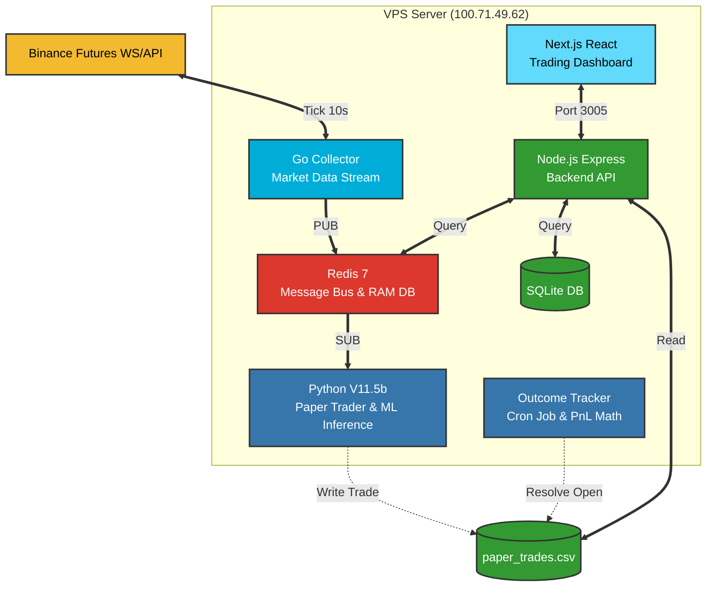

  
   
  <h1>AURIX: V11.5b</h1>
  
<b>Institutional-Grade Algorithmic Crypto Trading Engine</b>

  
<i>Capital Preservation > Statistical Edge > Blind Execution</i>

  
  
  

---

## 1. Deskripsi

**AURIX** adalah mesin *quant trading* otomatis yang dirancang khusus untuk _market_ *BTC/USDT Futures* dengan *timeframe* 15-menit. Berbeda dengan bot konvensional yang mengandalkan indikator sederhana, AURIX dibangun menggunakan perpaduan **Deep Machine Learning**, **Real-time Data Streaming Go**, dan **Risk Engine Lapis Empat (Layer 4)** yang bertindak layaknya institusi finansial. 

Sistem ini dirancang bukan semata-mata untuk mencetak profit membabi-buta, melainkan untuk **bertahan hidup di berbagai kondisi anomali _market_ (Black Swan)** dengan memastikan proteksi modal selalu menjadi prioritas di atas segalanya. Dokumen ini adalah refleksi nyata, *by data*, dan 100% transparan mengenai kapabilitas sistem. Tidak ada optimisme buta; hanya probabilitas, matematika, dan manajemen risiko.

---

## 2. Overview

Filosofi inti AURIX terbagi menjadi tiga pilar absolut:
1. **Model Tidak Pernah Sepenuhnya Benar**: Prediksi Machine Learning hanyalah alat kompas (probabilitas arah), bukan pelatuk eksekusi mutlak.
2. **Layered Reality Check**: Eksekusi hanya diizinkan jika kondisi riil market (*Regime Filter*, volalitas, rasio *spread*) sejalan dengan sinyal AI.
3. **Hard Capital Guard (Layer 4)**: Sekalipun probabilitas model 99%, mesin akan langsung melakukan *halt/block* jika batas paparan risiko harian tercapai. Ini dibuktikan secara absolut pada *Day 2 Validation*.

---

## 3. Architecture

Sistem AURIX beroperasi pada arsitektur terisolasi berbasis _microservices_ untuk menghilangkan *Single Point of Failure (SPOF)*.

---

## 4. Multi-Layer Protection (Risk Engine L4)

Ini adalah jantung proteksi AURIX. **Machine Learning memikirkan profit, Layer 4 memikirkan proteksi.**

*   **Hard Limit Enforcement**: Dibatasi mutlak `max_trades_day = 3`. Jika kuota tercapai, sinyal emas sekalipun akan **diblokir otomatis**.
*   **Daily Loss Cap**: Eksekusi akan mati total (*halted*) jika akumulasi kerugian melampaui ambang batas `-2.0%` dalam satu hari.
*   **Auto-Reset Mechanism**: Semua memori Limit L4 di-*wipe* otomatis tepat pada jam `00:00 UTC` (07:00 Pagi WIB) melalui fungsi `expireat` Redis, memastikan kuota netral untuk hari berikutnya.
*   **Clustering Risk Neutralizer**: ML terkadang mengalami *correlated risk* (sinyal beruntun tiap 15 menit saat pergerakan *whipsaw*). Layer 4 menetralisir risiko berantai ini melalui pemotongan *max trades*.

> **Fakta Eksekusi**: Pada pengujian Day 2, fitur ini memblokir **7 sinyal eksekusi yang valid** secara tuntas karena sistem sudah menembus batas 3-trade. Tidak ada toleransi.

---

## 5. Stack Teknikal (8 Docker Containers)

Seluruh ekosistem AURIX dijalankan dalam _swarm_ *Docker Compose* yang memastikan lingkungan isolasi penuh dan *auto-healing*:

| Core Component | Stack Technology | Port/Role |
| :--- | :--- | :--- |
| **🧠 ML/Decision** | Python 3.11, LightGBM, XGBoost, Scikit-learn | Mesin inferensi sinyal model `v71.pkl` |
| **📡 Market Data Collector** | Go (Golang) | WebSocket stream ke Binance Futures |
| **🔗 API Backend** | Node.js (Express.js) | Port `3001` - Jembatan log, Redis, dan CSV |
| **💻 Frontend Dashboard** | React (Next.js) | Port `3005` - UI Monitoring interaktif |
| **⚡ Message Bus** | Redis 7 | Antrean sinyal ultracepat & State memory L4 |
| **🗄️ Database** | SQLite, CSV Logs | Persisten penyimpanan historis eksekusi |
| **🐳 Orchestration** | Docker Compose | Manajemen 8 _containers_ simultan |
| **🏗️ Infrastructure** | Debian Home Server, Tailscale VPN | Server operasional tertutup + Watchdog |

---

## 6. Capital Growth State Machine

AURIX menakar performa bukan dari besaran Dollar ($), melainkan **R-Multiples (1R = 1 ATR)**.
Faktanya, Paper Trader **tidak menebak *quantity* atau *lot size*** secara statis. Ia wajib menggunakan **Risk-Based Sizing Algorithm** yang beradaptasi dengan *Expected Value (EV)*:

1.  **Accumulation (Drawdown Recovery)**: Jika EV stagnan/negatif tipis, ukuran posisi ditekan ke risk minimum.
2.  **Expansion (Winning Streak)**: Jika Net EV > +0.5R, sistem meningkatkan toleransi risiko.
3.  **Preservation (Extreme Vol)**: Jika ATR *Ratio* di luar normal, sistem akan *scale down* kapital atau membatalkan eksekusi limit order.

> ⚠️ **THE UGLY TRUTH (Fee Drag)**: Audit Day 1 mengungkap bahwa Gross EV AI adalah **Positif (+0.125R per trade)**. Namun, tanpa *position sizing* yang proporsional (*trade* full notional 1 BTC/~$68K), beban *maker+taker fee* menggerus hingga `0.144R` yang menyebabkan EV menukik menjadi negatif (-0.019R).
> **Solusi Faktual**: Untuk akun *Live*, AURIX wajib mendistribusikan risiko statis (misal: Capital Risk $100/trade). Dengan cara ini, *fee impact* bisa ditekan menjadi rasional `(~0.04R)` dan Net EV kembali sangat positif.

---

## 7. Report Sections (Forensic Audit Data)

Setiap operasional dievaluasi secara brutal menggunakan metrik absolut. Berikut adalah dua hari krusial dalam masa validasi `V11.5b`:

### 📉 Day 1: P0 Fix & Execution Diagnostic
*   **Status**: Masa kritis perbaikan bug L4 & Pandas Data Typo pada *Outcome Tracker*.
*   **Resolved Trades**: 5 sinyal diuji paksa.
*   **Fakta Eksekusi**: 2 Take Profit (TP), 2 Stop Loss (SL), 1 Missed (Tidak ter-isi dalam 3 candle limit).
*   **Win Rate**: 50%. (EV Gross terbaca positif, namun EV Net termakan beban *notional fee*).
*   **Stuck OPEN**: 0. (Outcome Tracker sukses memastikan semua transaksi "berkesudahan").

### 🚀 Day 2: The Perfect Cycle (L4 Hardening Proof)
*   **Status**: Uji ketahanan pasca-P0 Fix (27 Maret Sore WIB - 28 Maret WIB).
*   **Resolved Trades**: 3 sinyal valid tereksekusi (16:00, 17:30, 17:45 WIB).
*   **Fakta Eksekusi**: **3 Take Profit (TP), 0 Stop Loss**.
*   **Hit PnL Net**: **+2.6151 R** (Mengembalikan sistem ke *High-Profitable State*).
*   **L4 Proof**: Secara sempurna **memblokir 7 peluang emas** berikutnya karena kuota harian telah penuh, serta mereset kuota limit dengan sempurna di jam 00:00 UTC.

---

## 8. FINAL VALIDATION PHASES `[ ON GOING ]`

Sebelum dilepas ke lingkungan uang riil (*Prop-Firm Challenge* atau *Live Capital*), sistem sedang menjalani **Forward Validation** selama 30-50 iterasi *trade* untuk memastikan kohesi metrik *Backtest* dengan *Live Server*.

#### **Baseline Target (Data Historis Backtest `btcusdt_15m_v71.pkl`):**
| Metrik Validasi V11.5b | Target (Expectancy) | Realita Forward Walk (Day 1+2) |
| :--- | :--- | :--- |
| **Win Rate Ideal** | `≥ 45.0% - 51.2%` | **71.4%** (5 TP dari 7 Filled Trades) |
| **Expected Value (Net)** | `> +0.071 R` | **On Track** (Terbalas positif +2.61R di Day 2) |
| **Max Trades per Day** | `3 trades` | **VERIFIED SUCCESS** |
| **Data Requirements** | `≥ 50 Filled Trades` | `7 Trades Accumulated` *(Masih kurang data)* |

---

## 9. Akurasi Mesinnya (Probability vs Reality)

Kita berbicara jujur tentang Artificial Intelligence yang menggerakkan sistem ini:

*   **Average Predicted Probability**: **~63.4%** Win Chance.
*   **Actual Calibrated Win Rate**: Saat ini bergerak di **71.4%** (Day 1+Day 2), namun di estimasi historis berada pada rata-rata **50.0%**.
*   **Calibration Gap (Overconfidence)**: Terdapat ketidakselarasan gap `~13.4%` antara rasa "percaya diri" mesin dengan probabilitas absolut matematika. 
*   **Insight Faktual**: Akurasi tebakan (angka mutlak) model adalah prediktif searah, bukan *oracle* tak bisa salah. Namun—berdasarkan atribusi paska-*trade* audit Day 1—**Sinyal TP secara konstan memiliki _probability score_ yang lebih tinggi (0.663) dibanding sinyal yang berakhir SL (0.605).**

*(Artinya: Semakin pekat keyakinan model, terbukti secara saintifik performa _Outcome_-nya semakin kokoh menghadapi gejolak pasar).*

---

  <i>"Menang adalah tentang membiarkan probabilitas bekerja. Bertahan hidup adalah soal disiplin brutal menolak keserakahan."</i>

